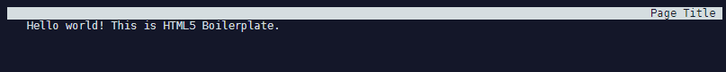

# Building a Full-Text Search App Using Docker and Elasticsearch on CentOS

This repository is based on this [tutorial](https://blog.patricktriest.com/text-search-docker-elasticsearch/) by Patrick Triest.

<!-- TOC -->

- [Building a Full-Text Search App Using Docker and Elasticsearch on CentOS](#building-a-full-text-search-app-using-docker-and-elasticsearch-on-centos)
  - [Containerization](#containerization)
    - [Install Docker](#install-docker)
    - [Install Docker-Compose](#install-docker-compose)
  - [Setup Project Directories](#setup-project-directories)
  - [Add Docker-Compose Config](#add-docker-compose-config)
  - [Add Dockerfile](#add-dockerfile)
  - [Testing the Frontend](#testing-the-frontend)
  - [Connect to Elasticsearch](#connect-to-elasticsearch)
    - [Add Helper Function To Reset Index](#add-helper-function-to-reset-index)
  - [Original README](#original-readme)

<!-- /TOC -->


## Containerization 

### Install Docker

Docker is the container runtime that we are going to use to run our containerized applications on.

First we need to add the repository to pull the Docker code from - type `nano /etc/yum.repos.d/virt7-docker-common-release.repo` and add:

```
[virt7-docker-common-release]
name=virt7-docker-common-release
baseurl=http://cbs.centos.org/repos/virt7-docker-common-release/x86_64/os/
gpgcheck=0
```

Then install [Docker](https://www.docker.com/), [Kubernetes](https://kubernetes.io) and [etcd](https://coreos.com/etcd/docs/latest/):

```bash
yum -y install docker kubernetes etcd
systemctl enable docker 
systemctl start docker
```


### Install Docker-Compose

Compose is a tool for defining and running multi-container Docker applications. With Compose, you use a YAML file to configure your application’s services. Then, with a single command, you create and start all the services from your configuration.


On Linux, you can download the [Docker Compose](https://docs.docker.com/compose/install/) binary from the [Compose repository release page on GitHub](https://github.com/docker/compose/releases). Run this command to download the latest version of Docker Compose:


```bash
curl -L "https://github.com/docker/compose/releases/download/1.23.2/docker-compose-Linux-x86_64" -o /usr/local/bin/docker-compose
```


Apply executable permissions to the binary:


```bash
chmod +x /usr/local/bin/docker-compose
```


Test the installation:


```bash
docker-compose --version
```


## Setup Project Directories

Create a directory for the project with two main subdirectories:

* `/public` - Store files for the frontend Vue.js webapp.
* `/server` - Server-side Node.js source code


```bash
mkdir /opt/docker/elasticsearch-docker/public && mkdir /opt/docker/elasticsearch-docker/server
```


## Add Docker-Compose Config

Next, we'll create a docker-compose.yml file to define each container in our application stack:


```bash
nano /opt/docker/elasticsearch-docker/docker-compose.yml
```


* es-api - The Node.js container for the backend application logic.
* es-frontend - An Ngnix container for serving the frontend webapp files.
* es-search - An Elasticsearch container for storing and searching data.


```yaml
version: '3.3'

services:
  api: # Node.js App
    container_name: es-api
    build: .
    ports:
      - "3000:3000" # Expose API port
      - "9229:9229" # Expose Node process debug port (disable in production)
    environment: # Set ENV vars
     - NODE_ENV=local
     - ES_HOST=elasticsearch
     - PORT=3000
    volumes: # Attach local book data directory
      - ./books:/usr/src/app/books

  frontend: # Nginx Server For Frontend App
    container_name: es-frontend
    image: nginx
    volumes: # Serve local "public" dir
      - ./public:/usr/share/nginx/html
    ports:
      - "8888:80" # Forward site to localhost:8888

  elasticsearch: # Elasticsearch Instance
    container_name: es-search
    image: docker.elastic.co/elasticsearch/elasticsearch:6.1.1
    volumes: # Persist ES data in seperate "esdata" volume
      - esdata:/usr/share/elasticsearch/data
    environment:
      - bootstrap.memory_lock=true
      - "ES_JAVA_OPTS=-Xms512m -Xmx512m"
      - discovery.type=single-node
    ports: # Expose Elasticsearch ports
      - "9300:9300"
      - "9200:9200"

volumes: # Define seperate volume for Elasticsearch data
  esdata:
```


## Add Dockerfile

We are using official prebuilt images for Nginx and Elasticsearch, but we'll need to build our own image for the Node.js app:


```bash
nano /opt/docker/elasticsearch-docker/Dockerfile
```


```dockerfile
# Use Node v8.9.0 LTS
FROM node:carbon

# Setup app working directory
WORKDIR /usr/src/app

# Copy package.json and package-lock.json
COPY package*.json ./

# Install app dependencies
RUN npm install

# Copy sourcecode
COPY . .

# Start app
CMD [ "npm", "start" ]
```


Now add a .dockerignore file to avoid copying unneeded files into the container:


```bash 
nano /opt/docker/elasticsearch-docker/.dockerignore
```


```
node_modules/
public/
```


## Testing the Frontend

Lets start by creating a test HTML file inside the __public__ directory: `nano /opt/docker/elasticsearch-docker/public/index.html`:


```html
<!doctype html>
<html class="no-js" lang="en">

<head>
  <meta charset="utf-8">
  <meta http-equiv="x-ua-compatible" content="ie=edge">
  <title>Page Title</title>
  <meta name="description" content="page description">
  <meta name="viewport" content="width=device-width, initial-scale=1">
  <link rel="apple-touch-icon" href="icon.png">
  <!-- Place favicon.ico in the root directory -->
</head>

<body>
  <!--[if lte IE 9]>
    <p class="browserupgrade">You are using an <strong>outdated</strong> browser. Please <a href="https://browsehappy.com/">upgrade your browser</a> to improve your experience and security.</p>
  <![endif]-->

  <!-- Add your site or application content here -->
  <p>Hello world! This is HTML5 Boilerplate.</p>
  <script src="https://cdnjs.cloudflare.com/ajax/libs/modernizr/2.8.3/modernizr.min.js"></script>
  <script
  src="http://code.jquery.com/jquery-3.3.1.min.js"
  integrity="sha256-FgpCb/KJQlLNfOu91ta32o/NMZxltwRo8QtmkMRdAu8="
  crossorigin="anonymous"></script>
</body>

</html>
```


Next, let's add our [Koa Webserver](https://github.com/koajs) by adding the following file `nano /opt/docker/elasticsearch-docker/server/app.js`:


```js
const Koa = require('koa')
const app = new Koa()

app.use(async (ctx, next) => {
  ctx.body = 'Backend is online!'
})

const port = process.env.PORT || 3000

app.listen(port, err => {
  if (err) console.error(err)
  console.log(`App Listening on Port ${port}`)
})
```


And finally, we need to add our `package.json` Node app configuration `nano /opt/docker/elasticsearch-docker/package.json`, that will be copied inside our container on build:


```json
{
  "name": "elasticsearch-docker",
  "version": "1.0.0",
  "description": "Running an Elasticsearch Instance inside a Docker Container with a Vue.js Frontend.",
  "scripts": {
    "start": "node --inspect=0.0.0.0:9229 server/app.js"
  },
  "repository": {
    "type": "git",
    "url": "git+https://github.com/mpolinowski/Guttenberg-Search"
  },
  "author": "patrick.triest@gmail.com",
  "license": "MIT",
  "homepage": "https://github.com/mpolinowski/Guttenberg-Search#readme",
  "dependencies": {
    "elasticsearch": "13.3.1",
    "joi": "13.0.1",
    "koa": "2.4.1",
    "koa-joi-validate": "0.5.1",
    "koa-router": "7.2.1"
  }
}
```

We should now be able to build and run our container with __docker-compose__:


```bash
docker-compose build
docker-compose up
```


You can use the program elinks (`yum -y install elinks`) to test if the container is up and serving our temporary front:


```bash
elinks http://localhost:8888
```





The backend should greet you on `elinks http://localhost:3000` with a __Backend is online!__. And last, but not least, there is the Elasticsearch service running on port __9200__:


## Connect to Elasticsearch

Add the following Elasticsearch initialization code to a new file `nano /opt/docker/elasticsearch-docker/server/connection.js`:


```js
const elasticsearch = require('elasticsearch')

// Core ES variables for this project
const index = 'library'
const type = 'novel'
const port = 9200
const host = process.env.ES_HOST || 'localhost'
const client = new elasticsearch.Client({ host: { host, port } })

/** Check the ES connection status */
async function checkConnection () {
  let isConnected = false
  while (!isConnected) {
    console.log('...connecting to Elasticsearch')
    try {
      const health = await client.cluster.health({})
      console.log(health)
      isConnected = true
    } catch (err) {
      console.log('Connection failed, retrying...', err)
    }
  }
}

checkConnection()
```

Now rebuild `docker-compose build` and run the container detached `docker-compose up -d`. We can start the __connection.js__ script inside the container with:


```
docker exec es-api "node" "server/connection.js"
```

The script should give you a status update about your ELasticsearch server looking something like this:


When successful, remove the line `checkConnection()` from __connection.js__.


### Add Helper Function To Reset Index

In server/connection.js add the following function below checkConnection, in order to provide an easy way to reset our Elasticsearch index.


```js
/** Clear the index, recreate it, and add mappings */
async function resetIndex () {
  if (await client.indices.exists({ index })) {
    await client.indices.delete({ index })
  }

  await client.indices.create({ index })
  await putBookMapping()
}
```


## Original README

*How does Wikipedia sort though 5+ million articles to find the most relevant one for your research?*

*How does Facebook find the friend who you're looking for (and whose name you've misspelled), across a userbase of 2+ billion people?*

*How does Google search the entire internet for webpages relevant to your vague, typo-filled search query?*

In this tutorial, we'll walk through setting up our own full-text search application (of an admittedly lesser complexity than the systems in the questions above).  Our example app will provide a UI and API to search the complete texts of 100 literary classics such as *Peter Pan*, *Frankenstein*, and *Treasure Island*.

You can preview a completed version of the tutorial app here - https://search.patricktriest.com


To read more, visit - https://blog.patricktriest.com/text-search-docker-elasticsearch/

___

This application is 100% open-source, feel free to utilize the code however you would like.

```
The MIT License (MIT)

Copyright (c) 2018 Patrick Triest

Permission is hereby granted, free of charge, to any person obtaining a copy
of this software and associated documentation files (the "Software"), to deal
in the Software without restriction, including without limitation the rights
to use, copy, modify, merge, publish, distribute, sublicense, and/or sell
copies of the Software, and to permit persons to whom the Software is
furnished to do so, subject to the following conditions:

The above copyright notice and this permission notice shall be included in all
copies or substantial portions of the Software.

THE SOFTWARE IS PROVIDED "AS IS", WITHOUT WARRANTY OF ANY KIND, EXPRESS OR
IMPLIED, INCLUDING BUT NOT LIMITED TO THE WARRANTIES OF MERCHANTABILITY,
FITNESS FOR A PARTICULAR PURPOSE AND NONINFRINGEMENT. IN NO EVENT SHALL THE
AUTHORS OR COPYRIGHT HOLDERS BE LIABLE FOR ANY CLAIM, DAMAGES OR OTHER
LIABILITY, WHETHER IN AN ACTION OF CONTRACT, TORT OR OTHERWISE, ARISING FROM,
OUT OF OR IN CONNECTION WITH THE SOFTWARE OR THE USE OR OTHER DEALINGS IN THE
SOFTWARE.
```
