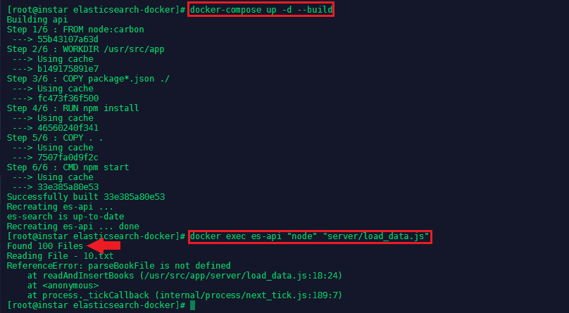

# Building a Full-Text Search App Using Docker and Elasticsearch on CentOS

This repository is based on this [tutorial](https://blog.patricktriest.com/text-search-docker-elasticsearch/) by Patrick Triest. See also [elasticsearch-docker](https://github.com/mpolinowski/elasticsearch-docker).

<!-- TOC -->

- [Building a Full-Text Search App Using Docker and Elasticsearch on CentOS](#building-a-full-text-search-app-using-docker-and-elasticsearch-on-centos)
  - [Containerization](#containerization)
    - [Install Docker](#install-docker)
    - [Install Docker-Compose](#install-docker-compose)
  - [Setup Project Directories](#setup-project-directories)
  - [Add Docker-Compose Config](#add-docker-compose-config)
  - [Add Dockerfile](#add-dockerfile)
  - [Testing the Frontend](#testing-the-frontend)
  - [Connect to Elasticsearch](#connect-to-elasticsearch)
    - [Add Helper Function To Reset Index](#add-helper-function-to-reset-index)
    - [Add your Database Schema](#add-your-database-schema)
    - [Adding Books to our Database](#adding-books-to-our-database)
      - [Discovering all available BSooks](#discovering-all-available-bsooks)
      - [Reading all Books](#reading-all-books)
      - [Adding all Books to the Index](#adding-all-books-to-the-index)
  - [Elastic Search Queries](#elastic-search-queries)
    - [Query Script](#query-script)
    - [Query API](#query-api)
    - [Link endpoint with queries](#link-endpoint-with-queries)
    - [Input validation](#input-validation)
  - [Vue.js Frontend](#vuejs-frontend)
    - [Adding Markup](#adding-markup)
    - [Adding Styles](#adding-styles)
    - [Adding Page Previews for Search Results](#adding-page-previews-for-search-results)
    - [Linking the API Endpoint](#linking-the-api-endpoint)
  - [Original README](#original-readme)

<!-- /TOC -->


## Containerization 

### Install Docker

Docker is the container runtime that we are going to use to run our containerized applications on.

First we need to add the repository to pull the Docker code from - type `nano /etc/yum.repos.d/virt7-docker-common-release.repo` and add:

```
[virt7-docker-common-release]
name=virt7-docker-common-release
baseurl=http://cbs.centos.org/repos/virt7-docker-common-release/x86_64/os/
gpgcheck=0
```

Then install [Docker](https://www.docker.com/), [Kubernetes](https://kubernetes.io) and [etcd](https://coreos.com/etcd/docs/latest/):

```bash
yum -y install docker kubernetes etcd
systemctl enable docker 
systemctl start docker
```


### Install Docker-Compose

Compose is a tool for defining and running multi-container Docker applications. With Compose, you use a YAML file to configure your application’s services. Then, with a single command, you create and start all the services from your configuration.


On Linux, you can download the [Docker Compose](https://docs.docker.com/compose/install/) binary from the [Compose repository release page on GitHub](https://github.com/docker/compose/releases). Run this command to download the latest version of Docker Compose:


```bash
curl -L "https://github.com/docker/compose/releases/download/1.23.2/docker-compose-Linux-x86_64" -o /usr/local/bin/docker-compose
```


Apply executable permissions to the binary:


```bash
chmod +x /usr/local/bin/docker-compose
```


Test the installation:


```bash
docker-compose --version
```


## Setup Project Directories

Create a directory for the project with two main subdirectories:

* `/public` - Store files for the frontend Vue.js webapp.
* `/server` - Server-side Node.js source code


```bash
mkdir /opt/docker/elasticsearch-docker/public && mkdir /opt/docker/elasticsearch-docker/server
```


## Add Docker-Compose Config

Next, we'll create a docker-compose.yml file to define each container in our application stack:


```bash
nano /opt/docker/elasticsearch-docker/docker-compose.yml
```


* es-api - The Node.js container for the backend application logic.
* es-frontend - An Ngnix container for serving the frontend webapp files.
* es-search - An Elasticsearch container for storing and searching data.


```yaml
version: '3.3'

services:
  api: # Node.js App
    container_name: es-api
    build: .
    ports:
      - "3000:3000" # Expose API port
      - "9229:9229" # Expose Node process debug port (disable in production)
    environment: # Set ENV vars
     - NODE_ENV=local
     - ES_HOST=elasticsearch
     - PORT=3000
    volumes: # Attach local book data directory
      - ./books:/usr/src/app/books

  frontend: # Nginx Server For Frontend App
    container_name: es-frontend
    image: nginx
    volumes: # Serve local "public" dir
      - ./public:/usr/share/nginx/html
    ports:
      - "8888:80" # Forward site to localhost:8888

  elasticsearch: # Elasticsearch Instance
    container_name: es-search
    image: docker.elastic.co/elasticsearch/elasticsearch:6.1.1
    volumes: # Persist ES data in seperate "esdata" volume
      - esdata:/usr/share/elasticsearch/data
    environment:
      - bootstrap.memory_lock=true
      - "ES_JAVA_OPTS=-Xms512m -Xmx512m"
      - discovery.type=single-node
    ports: # Expose Elasticsearch ports
      - "9300:9300"
      - "9200:9200"

volumes: # Define seperate volume for Elasticsearch data
  esdata:
```


## Add Dockerfile

We are using official prebuilt images for Nginx and Elasticsearch, but we'll need to build our own image for the Node.js app:


```bash
nano /opt/docker/elasticsearch-docker/Dockerfile
```


```dockerfile
# Use Node v8.9.0 LTS
FROM node:carbon

# Setup app working directory
WORKDIR /usr/src/app

# Copy package.json and package-lock.json
COPY package*.json ./

# Install app dependencies
RUN npm install

# Copy sourcecode
COPY . .

# Start app
CMD [ "npm", "start" ]
```


Now add a .dockerignore file to avoid copying unneeded files into the container:


```bash 
nano /opt/docker/elasticsearch-docker/.dockerignore
```


```
node_modules/
books/
public/
```


## Testing the Frontend

Lets start by creating a test HTML file inside the __public__ directory: `nano /opt/docker/elasticsearch-docker/public/index.html`:


```html
<!doctype html>
<html class="no-js" lang="en">

<head>
  <meta charset="utf-8">
  <meta http-equiv="x-ua-compatible" content="ie=edge">
  <title>Page Title</title>
  <meta name="description" content="page description">
  <meta name="viewport" content="width=device-width, initial-scale=1">
  <link rel="apple-touch-icon" href="icon.png">
  <!-- Place favicon.ico in the root directory -->
</head>

<body>
  <!--[if lte IE 9]>
    <p class="browserupgrade">You are using an <strong>outdated</strong> browser. Please <a href="https://browsehappy.com/">upgrade your browser</a> to improve your experience and security.</p>
  <![endif]-->

  <!-- Add your site or application content here -->
  <p>Hello world! This is HTML5 Boilerplate.</p>
  <script src="https://cdnjs.cloudflare.com/ajax/libs/modernizr/2.8.3/modernizr.min.js"></script>
  <script
  src="http://code.jquery.com/jquery-3.3.1.min.js"
  integrity="sha256-FgpCb/KJQlLNfOu91ta32o/NMZxltwRo8QtmkMRdAu8="
  crossorigin="anonymous"></script>
</body>

</html>
```


Next, let's add our [Koa Webserver](https://github.com/koajs) by adding the following file `nano /opt/docker/elasticsearch-docker/server/app.js`:


```js
const Koa = require('koa')
const app = new Koa()

app.use(async (ctx, next) => {
  ctx.body = 'Backend is online!'
})

const port = process.env.PORT || 3000

app
  .use(router.routes())
  .use(router.allowedMethods())
  .listen(port, err => {
    if (err) console.error(err)
    console.log(`App Listening on Port ${port}`)
  })
```


And finally, we need to add our `package.json` Node app configuration `nano /opt/docker/elasticsearch-docker/package.json`, that will be copied inside our container on build:


```json
{
  "name": "elasticsearch-docker",
  "version": "1.0.0",
  "description": "Running an Elasticsearch Instance inside a Docker Container with a Vue.js Frontend.",
  "scripts": {
    "start": "node --inspect=0.0.0.0:9229 server/app.js"
  },
  "repository": {
    "type": "git",
    "url": "git+https://github.com/mpolinowski/Guttenberg-Search"
  },
  "author": "patrick.triest@gmail.com",
  "license": "MIT",
  "homepage": "https://github.com/mpolinowski/Guttenberg-Search#readme",
  "dependencies": {
    "elasticsearch": "13.3.1",
    "joi": "13.0.1",
    "koa": "2.4.1",
    "koa-joi-validate": "0.5.1",
    "koa-router": "7.2.1"
  }
}
```

We should now be able to build and run our container with __docker-compose__:


```bash
docker-compose build
docker-compose up
```


You can use the program elinks (`yum -y install elinks`) to test if the container is up and serving our temporary front:


```bash
elinks http://localhost:8888
```


The backend should greet you on `elinks http://localhost:3000` with a __Backend is online!__. And last, but not least, there is the Elasticsearch service running on port __9200__:


## Connect to Elasticsearch

Add the following Elasticsearch initialization code to a new file `nano /opt/docker/elasticsearch-docker/server/connection.js`:


```js
const elasticsearch = require('elasticsearch')

// Core ES variables for this project
const index = 'library'
const type = 'book'
const port = 9200
const host = process.env.ES_HOST || 'localhost'
const client = new elasticsearch.Client({ host: { host, port } })

/** Check the ES connection status */
async function checkConnection () {
  let isConnected = false
  while (!isConnected) {
    console.log('...connecting to Elasticsearch')
    try {
      const health = await client.cluster.health({})
      console.log(health)
      isConnected = true
    } catch (err) {
      console.log('Connection failed, retrying...', err)
    }
  }
}

checkConnection()
```


Now rebuild `docker-compose build` and run the container detached `docker-compose up -d`. We can start the __connection.js__ script inside the container with:


```
docker exec es-api "node" "server/connection.js"
```

The script should give you a status update about your ELasticsearch server looking something like this:


When successful, remove the line `checkConnection()` from __connection.js__.


### Add Helper Function To Reset Index

In `server/connection.js` add the following function below __checkConnection__, in order to provide an easy way to reset our Elasticsearch index.


```js
/** Clear the index, recreate it, and add mappings */
async function resetIndex () {
  if (await client.indices.exists({ index })) {
    await client.indices.delete({ index })
  }

  await client.indices.create({ index })
  await putBookMapping()
}
```


### Add your Database Schema

Add the following function below __resetIndex__ in `server/connection.js`: 


```js
/** Add book section schema mapping to ES */
async function putBookMapping () {
  const schema = {
    title: { type: 'keyword' },
    author: { type: 'keyword' },
    location: { type: 'integer' },
    text: { type: 'text' }
  }

  return client.indices.putMapping({ index, type, body: { properties: schema } })
}
```

This defines an index for our books. Adding a mapping allows us to specify each field and datatype for the stored documents.

For instance - we're assigning the keyword type to the "title" and "author" fields, and the text type to the "text" field. Doing so will cause the search engine to treat these string fields differently - During a search, the engine will search within the text field for potential matches using special analyzers, whereas keyword fields will be matched based on their complete string.


We need to export the exposed properties and functions at the bottom of the file, so that they can be accessed by other modules in our app:


```js
module.exports = {
  client, index, type, checkConnection, resetIndex
}
```

The server connection file should now look like this:


### Adding Books to our Database

#### Discovering all available BSooks

We are going to use books from the [Project Gutenberg](https://www.gutenberg.org/) to build our book index from. You can get a zipped collection of 100 books [from here](https://cdn.patricktriest.com/data/books.zip). Extract this file into a `./books/` directory in your project - you might need to `yum install -y unzip`:


```bash
wget https://cdn.patricktriest.com/data/books.zip
unzip books.zip
```

All files start with an open access license, followed by some lines identifying the book __Title__, __Author__, __Release Date__, __Language__ and __Character Encoding__:


After these lines comes \*\*\* START OF THIS PROJECT GUTENBERG EBOOK THE PICTURE OF DORIAN GRAY \*\*\* , after which the book content actually starts. If you scroll to the end of the book you'll see the matching message \*\*\* END OF THIS PROJECT GUTENBERG EBOOK THE PICTURE OF DORIAN GRAY \*\*\*, which is followed by a much more detailed version of the book's license.


To add those books, we first need to obtain a list of every file within the `./books` directory. Create a new file `nano /opt/docker/elasticsearch-docker/server/load_data.js` and add the following content:


```js
const fs = require('fs')
const path = require('path')
const esConnection = require('./connection')

/** Clear ES index, parse and index all files from the books directory */
async function readAndInsertBooks () {
  try {
    // Clear previous ES index
    await esConnection.resetIndex()

    // Read books directory
    let files = fs.readdirSync('./books').filter(file => file.slice(-4) === '.txt')
    console.log(`Found ${files.length} Files`)

    // Read each book file, and index each paragraph in elasticsearch
    for (let file of files) {
      console.log(`Reading File - ${file}`)
      const filePath = path.join('./books', file)
      const { title, author, paragraphs } = parseBookFile(filePath)
      await insertBookData(title, author, paragraphs)
    }
  } catch (err) {
    console.error(err)
  }
}

readAndInsertBooks()
```


Then run an updated build of the container:


```bash
docker-compose up -d --build
docker exec es-api "node" "server/load_data.js"
```





You will see that __100 books__ were found.


#### Reading all Books

Next, we'll read the metadata and content for each book. This will be defined in a new function in `nano /opt/docker/elasticsearch-docker/server/load_data.js`. Add this function _on top_ of the __readAndInsertBooks__ we added in the previous step:


```js
/** Read an individual book text file, and extract the title, author, and paragraphs */
function parseBookFile (filePath) {
  // Read text file
  const book = fs.readFileSync(filePath, 'utf8')

  // Find book title and author
  const title = book.match(/^Title:\s(.+)$/m)[1]
  const authorMatch = book.match(/^Author:\s(.+)$/m)
  const author = (!authorMatch || authorMatch[1].trim() === '') ? 'Unknown Author' : authorMatch[1]

  console.log(`Reading Book - ${title} By ${author}`)

  // Find Guttenberg metadata header and footer
  const startOfBookMatch = book.match(/^\*{3}\s*START OF (THIS|THE) PROJECT GUTENBERG EBOOK.+\*{3}$/m)
  const startOfBookIndex = startOfBookMatch.index + startOfBookMatch[0].length
  const endOfBookIndex = book.match(/^\*{3}\s*END OF (THIS|THE) PROJECT GUTENBERG EBOOK.+\*{3}$/m).index

  // Clean book text and split into array of paragraphs
  const paragraphs = book
    .slice(startOfBookIndex, endOfBookIndex) // Remove Guttenberg header and footer
    .split(/\n\s+\n/g) // Split each paragraph into it's own array entry
    .map(line => line.replace(/\r\n/g, ' ').trim()) // Remove paragraph line breaks and whitespace
    .map(line => line.replace(/_/g, '')) // Guttenberg uses "_" to signify italics.  We'll remove it, since it makes the raw text look messy.
    .filter((line) => (line && line !== '')) // Remove empty lines

  console.log(`Parsed ${paragraphs.length} Paragraphs\n`)
  return { title, author, paragraphs }
}
```

This function performs a few important tasks.

* Read book text from the file system.
* Use regular expressions (check out this post for a primer on using regex) to parse the book title and author.
* Identify the start and end of the book content, by matching on the all-caps "Project Guttenberg" header and footer.
* Extract the book text content.
* Split each paragraph into its own array.
* Clean up the text and remove blank lines.

As a return value, we'll form an object containing the book's title, author, and an array of paragraphs within the book.


Then run an updated build of the container:


```bash
docker-compose up -d --build
docker exec es-api "node" "server/load_data.js"
```


You should see the same output as before, this time with three extra lines at the end of the output. The script successfully parsed the title and author from the text file.


#### Adding all Books to the Index

As a final step, we'll bulk-upload each array of paragraphs into the Elasticsearch index. We do this inside a new `insertBookData` function below `parseBookFile` in `nano /opt/docker/elasticsearch-docker/server/load_data.js`:


```js
/** Bulk index the book data in Elasticsearch */
async function insertBookData (title, author, paragraphs) {
  let bulkOps = [] // Array to store bulk operations

  // Add an index operation for each section in the book
  for (let i = 0; i < paragraphs.length; i++) {
    // Describe action
    bulkOps.push({ index: { _index: esConnection.index, _type: esConnection.type } })

    // Add document
    bulkOps.push({
      author,
      title,
      location: i,
      text: paragraphs[i]
    })

    if (i > 0 && i % 500 === 0) { // Do bulk insert in 500 paragraph batches
      await esConnection.client.bulk({ body: bulkOps })
      bulkOps = []
      console.log(`Indexed Paragraphs ${i - 499} - ${i}`)
    }
  }

  // Insert remainder of bulk ops array
  await esConnection.client.bulk({ body: bulkOps })
  console.log(`Indexed Paragraphs ${paragraphs.length - (bulkOps.length / 2)} - ${paragraphs.length}\n\n\n`)
}
```


The file should now have three functions in it:


This function will index each paragraph of the book, with author, title, and paragraph location metadata attached. We are inserting the paragraphs using a bulk operation, which is much faster than indexing each paragraph individually.


Then run an updated build of the container:


```bash
docker-compose up -d --build
docker exec es-api "node" "server/load_data.js"
```


You should now see a full output of 100 books being parsed and inserted in Elasticsearch.


## Elastic Search Queries


Visit this URL in your browser - `elinks http://localhost:9200/library/_search?q=ferryboat` - you should see a JSON response from your ES __library index__ we created:


### Query Script

To protect the Elasticsearch API we should query Elasticsearch from our Node.js application. Create a new file, `nano /opt/docker/elasticsearch-docker/server/search.js`:


```js
const { client, index, type } = require('./connection')

module.exports = {
  /** Query ES index for the provided term */
  queryTerm (term, offset = 0) {
    const body = {
      from: offset,
      query: { match: {
        text: {
          query: term,
          operator: 'and',
          fuzziness: 'auto'
        } } },
      highlight: { fields: { text: {} } }
    }

    return client.search({ index, type, body })
  }
}
```


Our search module defines a simple [search function](https://www.elastic.co/guide/en/elasticsearch/reference/current/full-text-queries.html), which will perform a match query using the input term:


* `from` - Allows us to paginate the results. Each query returns 10 results by default, so specifying from: 10 would allow us to retrieve results 10-20.
* `query` - Where we specify the actual term that we are searching for.
* `operator` - We can modify the search behavior; in this case, we're using the "and" operator to prioritize results that contain all of the tokens (words) in the query.
* `fuzziness` - Adjusts tolerance for spelling mistakes, auto defaults to fuzziness: 2. A higher fuzziness will allow for more corrections in result hits. For instance, fuzziness: 1 would allow Patricc to return Patrick as a match.
* `highlights` - Returns an extra field with the result, containing HTML to display the exact text subset and terms that were matched with the query.


### Query API

Replace the existing `server/app.js` file with the following content:


```js

const Koa = require('koa')
const Router = require('koa-router')
const joi = require('joi')
const validate = require('koa-joi-validate')
const search = require('./search')

const app = new Koa()
const router = new Router()

// Log each request to the console
app.use(async (ctx, next) => {
  const start = Date.now()
  await next()
  const ms = Date.now() - start
  console.log(`${ctx.method} ${ctx.url} - ${ms}`)
})

// Log percolated errors to the console
app.on('error', err => {
  console.error('Server Error', err)
})

// Set permissive CORS header
app.use(async (ctx, next) => {
  ctx.set('Access-Control-Allow-Origin', '*')
  return next()
})

// ADD ENDPOINTS HERE

const port = process.env.PORT || 3000

app
  .use(router.routes())
  .use(router.allowedMethods())
  .listen(port, err => {
    if (err) throw err
    console.log(`App Listening on Port ${port}`)
  })
```


This code will import our server dependencies and set up simple logging and error handling for a [Koa.js](http://koajs.com/) Node API server.


### Link endpoint with queries

Insert the following code below the __// ADD ENDPOINTS HERE__ comment in `server/app.js`:

```js
/**
 * GET /search
 * Search for a term in the library
 */
router.get('/search', async (ctx, next) => {
    const { term, offset } = ctx.request.query
    ctx.body = await search.queryTerm(term, offset)
  }
)
```

Restart the app using `docker-compose up -d --build`. Before we had to contact the Elasticsearch API on __port 9200__ directly - now we are able to use the search endpoint from our API on __port 3000__. For example, this request would search the entire library for passages mentioning `ferryboat`:


```
elinks http://localhost:3000/search?term=ferryboat
```


### Input validation

Now let's add some middleware to the endpoint in order to validate input parameters using [Joi](https://github.com/hapijs/joi) and the [Koa-Joi-Validate](https://github.com/triestpa/koa-joi-validate) library so invalid or missing values would result in a server error. Replace the endpoint we just added with the following code:


```js
/**
 * GET /search
 * Search for a term in the library
 * Query Params -
 * term: string under 60 characters
 * offset: positive integer
 */
router.get('/search',
  validate({
    query: {
      term: joi.string().max(60).required(),
      offset: joi.number().integer().min(0).default(0)
    }
  }),
  async (ctx, next) => {
    const { term, offset } = ctx.request.query
    ctx.body = await search.queryTerm(term, offset)
  }
)
```


Now, if you restart the server and make a request with a missing term `elinks http://localhost:3000/search`, you will get back an HTTP 400 error with a relevant message, such as Invalid URL Query:


To view live logs from the Node app, you can run `docker-compose logs -f api`:


## Vue.js Frontend

Add a new file, `nano /opt/docker/elasticsearch-docker/public/app.js`, to hold our Vue.js application code:


```js
const vm = new Vue ({
  el: '#vue-instance',
  data () {
    return {
      baseUrl: 'http://localhost:3000', // API url
      searchTerm: 'Hello World', // Default search term
      searchDebounce: null, // Timeout for search bar debounce
      searchResults: [], // Displayed search results
      numHits: null, // Total search results found
      searchOffset: 0, // Search result pagination offset

      selectedParagraph: null, // Selected paragraph object
      bookOffset: 0, // Offset for book paragraphs being displayed
      paragraphs: [] // Paragraphs being displayed in book preview window
    }
  },
  async created () {
    this.searchResults = await this.search() // Search for default term
  },
  methods: {
    /** Debounce search input by 100 ms */
    onSearchInput () {
      clearTimeout(this.searchDebounce)
      this.searchDebounce = setTimeout(async () => {
        this.searchOffset = 0
        this.searchResults = await this.search()
      }, 100)
    },
    /** Call API to search for inputted term */
    async search () {
      const response = await axios.get(`${this.baseUrl}/search`, { params: { term: this.searchTerm, offset: this.searchOffset } })
      this.numHits = response.data.hits.total
      return response.data.hits.hits
    },
    /** Get next page of search results */
    async nextResultsPage () {
      if (this.numHits > 10) {
        this.searchOffset += 10
        if (this.searchOffset + 10 > this.numHits) { this.searchOffset = this.numHits - 10}
        this.searchResults = await this.search()
        document.documentElement.scrollTop = 0
      }
    },
    /** Get previous page of search results */
    async prevResultsPage () {
      this.searchOffset -= 10
      if (this.searchOffset < 0) { this.searchOffset = 0 }
      this.searchResults = await this.search()
      document.documentElement.scrollTop = 0
    }
  }
})
```


We are adding methods to retrieve and paginate through search results. The search input is debounced by 100ms, to prevent the API from being called with every keystroke.


### Adding Markup

Replace our placeholder `nano /opt/docker/elasticsearch-docker/public/index.html` file with the following contents, in order to load our Vue.js app and to layout a basic search interface:


```html
<!DOCTYPE html>
<html lang="en">
<head>
  <meta charset="utf-8">
  <title>Elastic Library</title>
  <meta name="description" content="Literary Classic Search Engine.">
  <meta name="viewport" content="width=device-width, initial-scale=1, maximum-scale=1, user-scalable=no">
  <link href="https://cdnjs.cloudflare.com/ajax/libs/normalize/7.0.0/normalize.min.css" rel="stylesheet" type="text/css" />
  <link href="https://cdn.muicss.com/mui-0.9.20/css/mui.min.css" rel="stylesheet" type="text/css" />
  <link href="https://fonts.googleapis.com/css?family=EB+Garamond:400,700|Open+Sans" rel="stylesheet">
  <link href="styles.css" rel="stylesheet" />
</head>
<body>
<div class="app-container" id="vue-instance">
    <!-- Search Bar Header -->
    <div class="mui-panel">
      <div class="mui-textfield">
        <input v-model="searchTerm" type="text" v-on:keyup="onSearchInput()">
        <label>Search</label>
      </div>
    </div>

    <!-- Search Metadata Card -->
    <div class="mui-panel">
      <div class="mui--text-headline">{{ numHits }} Hits</div>
      <div class="mui--text-subhead">Displaying Results {{ searchOffset }} - {{ searchOffset + 9 }}</div>
    </div>

    <!-- Top Pagination Card -->
    <div class="mui-panel pagination-panel">
        <button class="mui-btn mui-btn--flat" v-on:click="prevResultsPage()">Prev Page</button>
        <button class="mui-btn mui-btn--flat" v-on:click="nextResultsPage()">Next Page</button>
    </div>

    <!-- Search Results Card List -->
    <div class="search-results" ref="searchResults">
      <div class="mui-panel" v-for="hit in searchResults" v-on:click="showBookModal(hit)">
        <div class="mui--text-title" v-html="hit.highlight.text[0]"></div>
        <div class="mui-divider"></div>
        <div class="mui--text-subhead">{{ hit._source.title }} - {{ hit._source.author }}</div>
        <div class="mui--text-body2">Location {{ hit._source.location }}</div>
      </div>
    </div>

    <!-- Bottom Pagination Card -->
    <div class="mui-panel pagination-panel">
        <button class="mui-btn mui-btn--flat" v-on:click="prevResultsPage()">Prev Page</button>
        <button class="mui-btn mui-btn--flat" v-on:click="nextResultsPage()">Next Page</button>
    </div>

    <!-- INSERT BOOK MODAL HERE -->
</div>
<script src="https://cdn.muicss.com/mui-0.9.28/js/mui.min.js"></script>
<script src="https://cdnjs.cloudflare.com/ajax/libs/vue/2.5.3/vue.min.js"></script>
<script src="https://cdnjs.cloudflare.com/ajax/libs/axios/0.17.0/axios.min.js"></script>
<script src="app.js"></script>
</body>
</html>
```


### Adding Styles

Add a new file, `nano /opt/docker/elasticsearch-docker/public/styles.css`, with some custom UI styling:


```css
body { font-family: 'EB Garamond', serif; }

.mui-textfield > input, .mui-btn, .mui--text-subhead, .mui-panel > .mui--text-headline {
  font-family: 'Open Sans', sans-serif;
}

.all-caps { text-transform: uppercase; }
.app-container { padding: 16px; }
.search-results em { font-weight: bold; }
.book-modal > button { width: 100%; }
.search-results .mui-divider { margin: 14px 0; }

.search-results {
  display: flex;
  flex-direction: row;
  flex-wrap: wrap;
  justify-content: space-around;
}

.search-results > div {
  flex-basis: 45%;
  box-sizing: border-box;
  cursor: pointer;
}

@media (max-width: 600px) {
  .search-results > div { flex-basis: 100%; }
}

.paragraphs-container {
  max-width: 800px;
  margin: 0 auto;
  margin-bottom: 48px;
}

.paragraphs-container .mui--text-body1, .paragraphs-container .mui--text-body2 {
  font-size: 1.8rem;
  line-height: 35px;
}

.book-modal {
  width: 100%;
  height: 100%;
  padding: 40px 10%;
  box-sizing: border-box;
  margin: 0 auto;
  background-color: white;
  overflow-y: scroll;
  position: fixed;
  top: 0;
  left: 0;
}

.pagination-panel {
  display: flex;
  justify-content: space-between;
}

.title-row {
  display: flex;
  justify-content: space-between;
  align-items: flex-end;
}

@media (max-width: 600px) {
  .title-row{ 
    flex-direction: column; 
    text-align: center;
    align-items: center
  }
}

.locations-label {
  text-align: center;
  margin: 8px;
}

.modal-footer {
  position: fixed;
  bottom: 0;
  left: 0;
  width: 100%;
  display: flex;
  justify-content: space-around;
  background: white;
}
```


Restart the app using `docker-compose up -d --build` and open the interface on `elinks http://localhost:8888`:


To access the page from a different system, add a firewall rule in FirewallD:


```
firewall-cmd --permanent --zone=public --add-port=8888/tcp
firewall-cmd --reload
firewall-cmd --zone=public --list-all
```


You can now access the site over the IP address of the server that your using to run Docker:


### Adding Page Previews for Search Results

Add the following function to the __module.exports__ block in `nano /opt/docker/elasticsearch-docker/server/search.js`:


```js
/** Get the specified range of paragraphs from a book */
getParagraphs (bookTitle, startLocation, endLocation) {
  const filter = [
    { term: { title: bookTitle } },
    { range: { location: { gte: startLocation, lte: endLocation } } }
  ]

  const body = {
    size: endLocation - startLocation,
    sort: { location: 'asc' },
    query: { bool: { filter } }
  }

  return client.search({ index, type, body })
}
```

This new function will return an ordered array of paragraphs between the start and end locations of a given book.


### Linking the API Endpoint

Add the following to `nano /opt/docker/elasticsearch-docker/server/app.js`, below the original __/search__ endpoint.


```js
/**
 * GET /paragraphs
 * Get a range of paragraphs from the specified book
 * Query Params -
 * bookTitle: string under 256 characters
 * start: positive integer
 * end: positive integer greater than start
 */
router.get('/paragraphs',
  validate({
    query: {
      bookTitle: joi.string().max(256).required(),
      start: joi.number().integer().min(0).default(0),
      end: joi.number().integer().greater(joi.ref('start')).default(10)
    }
  }),
  async (ctx, next) => {
    const { bookTitle, start, end } = ctx.request.query
    ctx.body = await search.getParagraphs(bookTitle, start, end)
  }
)
```


Now that the __/paragraphs__ endpoint is in place, let's add some frontend functionality to query and display full pages from the book. Add the following functions to the methods block of `nano /opt/docker/elasticsearch-docker/public/app.js`:


```js
/** Call the API to get current page of paragraphs */
    async getParagraphs (bookTitle, offset) {
      try {
        this.bookOffset = offset
        const start = this.bookOffset
        const end = this.bookOffset + 10
        const response = await axios.get(`${this.baseUrl}/paragraphs`, { params: { bookTitle, start, end } })
        return response.data.hits.hits
      } catch (err) {
        console.error(err)
      }
    },
    /** Get next page (next 10 paragraphs) of selected book */
    async nextBookPage () {
      this.$refs.bookModal.scrollTop = 0
      this.paragraphs = await this.getParagraphs(this.selectedParagraph._source.title, this.bookOffset + 10)
    },
    /** Get previous page (previous 10 paragraphs) of selected book */
    async prevBookPage () {
      this.$refs.bookModal.scrollTop = 0
      this.paragraphs = await this.getParagraphs(this.selectedParagraph._source.title, this.bookOffset - 10)
    },
    /** Display paragraphs from selected book in modal window */
    async showBookModal (searchHit) {
      try {
        document.body.style.overflow = 'hidden'
        this.selectedParagraph = searchHit
        this.paragraphs = await this.getParagraphs(searchHit._source.title, searchHit._source.location - 5)
      } catch (err) {
        console.error(err)
      }
    },
    /** Close the book detail modal */
    closeBookModal () {
      document.body.style.overflow = 'auto'
      this.selectedParagraph = null
    }
```


These five functions provide the logic for downloading and paginating through pages (ten paragraphs each) in a book.

Now we just need to add a UI to display the book pages. Add this markup below the `<!-- INSERT BOOK MODAL HERE -->` comment in `nano /opt/docker/elasticsearch-docker/public/index.html`:


```html
<!-- Book Paragraphs Modal Window -->
    <div v-if="selectedParagraph" ref="bookModal" class="book-modal">
      <div class="paragraphs-container">
        <!-- Book Section Metadata -->
        <div class="title-row">
          <div class="mui--text-display2 all-caps">{{ selectedParagraph._source.title }}</div>
          <div class="mui--text-display1">{{ selectedParagraph._source.author }}</div>
        </div>
        <br>
        <div class="mui-divider"></div>
        <div class="mui--text-subhead locations-label">Locations {{ bookOffset - 5 }} to {{ bookOffset + 5 }}</div>
        <div class="mui-divider"></div>
        <br>

        <!-- Book Paragraphs -->
        <div v-for="paragraph in paragraphs">
          <div v-if="paragraph._source.location === selectedParagraph._source.location" class="mui--text-body2">
            <strong>{{ paragraph._source.text }}</strong>
          </div>
          <div v-else class="mui--text-body1">
            {{ paragraph._source.text }}
          </div>
          <br>
        </div>
      </div>

      <!-- Book Pagination Footer -->
      <div class="modal-footer">
        <button class="mui-btn mui-btn--flat" v-on:click="prevBookPage()">Prev Page</button>
        <button class="mui-btn mui-btn--flat" v-on:click="closeBookModal()">Close</button>
        <button class="mui-btn mui-btn--flat" v-on:click="nextBookPage()">Next Page</button>
      </div>
    </div>
```


Restart the app server `docker-compose up -d --build` again and open up localhost:8080. When you click on a search result, you are now able to view the surrounding paragraphs.


## Original README

*How does Wikipedia sort though 5+ million articles to find the most relevant one for your research?*

*How does Facebook find the friend who you're looking for (and whose name you've misspelled), across a userbase of 2+ billion people?*

*How does Google search the entire internet for webpages relevant to your vague, typo-filled search query?*

In this tutorial, we'll walk through setting up our own full-text search application (of an admittedly lesser complexity than the systems in the questions above).  Our example app will provide a UI and API to search the complete texts of 100 literary classics such as *Peter Pan*, *Frankenstein*, and *Treasure Island*.

You can preview a completed version of the tutorial app here - https://search.patricktriest.com


To read more, visit - https://blog.patricktriest.com/text-search-docker-elasticsearch/

___

This application is 100% open-source, feel free to utilize the code however you would like.

```
The MIT License (MIT)

Copyright (c) 2018 Patrick Triest

Permission is hereby granted, free of charge, to any person obtaining a copy
of this software and associated documentation files (the "Software"), to deal
in the Software without restriction, including without limitation the rights
to use, copy, modify, merge, publish, distribute, sublicense, and/or sell
copies of the Software, and to permit persons to whom the Software is
furnished to do so, subject to the following conditions:

The above copyright notice and this permission notice shall be included in all
copies or substantial portions of the Software.

THE SOFTWARE IS PROVIDED "AS IS", WITHOUT WARRANTY OF ANY KIND, EXPRESS OR
IMPLIED, INCLUDING BUT NOT LIMITED TO THE WARRANTIES OF MERCHANTABILITY,
FITNESS FOR A PARTICULAR PURPOSE AND NONINFRINGEMENT. IN NO EVENT SHALL THE
AUTHORS OR COPYRIGHT HOLDERS BE LIABLE FOR ANY CLAIM, DAMAGES OR OTHER
LIABILITY, WHETHER IN AN ACTION OF CONTRACT, TORT OR OTHERWISE, ARISING FROM,
OUT OF OR IN CONNECTION WITH THE SOFTWARE OR THE USE OR OTHER DEALINGS IN THE
SOFTWARE.
```
